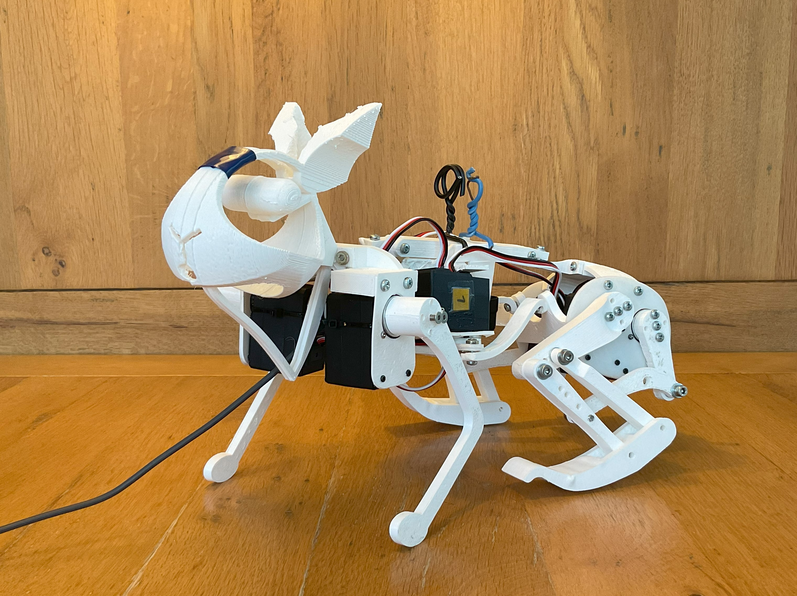

# Project Summary

This project successfully replicates the anatomy of a dwarf rabbit in a robotic model. Through reinforcement learning (RL), specifically using SAC and PPO algorithms, the robot's locomotion and jumping acrobatics were trained in a realistic simulation. These movements were later tested on the physical robot, demonstrating mastery of basic movements, such as forward walking.

### Key Results
- The robot was built based on the biological structure of a dwarf rabbit.
- A comparison of PPO and SAC algorithms revealed that SAC more efficiently mimicked the natural movements of a rabbit.
- Different terrain types led to the robot learning varied locomotion strategies, offering fascinating insights into the adaptability of RL models.

For more detailed findings, you can read the [corresponding paper here](MA_2024_TechKaninchenNachbildung.pdf).

---

# Getting Started

The provided source code allows you to:
- Simulate the robotic rabbit in various environments.
- Train the robot using SAC or PPO algorithms from the Stable Baselines3 library.
  
### Requirements
Ensure you have installed all the necessary libraries by following the instructions in the `requirements.txt` file.

### Training a New RL Agent
You can use the scripts in the `App` folder to train new RL agents:
- **`train_PPO.py`** or **`train_SAC.py`**: These scripts allow you to train an RL agent using expert trajectories. You can modify hyperparameters and environment parameters as needed. 
- Expert trajectories are stored in the `expert_trajectories` folder.

If you want to create custom expert movements, you can use:
- **`manual_controlled_robot.py`**: This interface allows you to manually control the robot and generate new expert trajectories.

### Running a Pre-Trained RL Agent
To experience the movements of a trained RL agent:
1. Load an environment by selecting an `info.txt` file.
2. Open a trained RL agent file (with a `.zip` extension) that corresponds to the selected environment.
3. Activate the RL model by selecting the appropriate checkbox.

---

# Fine-tuning

If you wish to fine-tune an existing model, use the `finetuning_SAC.py` script in the `App` folder.

---

# Custom Callbacks

The `Callbacks.py` script contains useful custom callbacks that allow for:
- Adjusting the learning rate during training.
- Automatically saving the best-performing agent.
- Tracking the relative rewards provided by the environment.

---

# Additional Code

Other scripts in this repository were used for evaluations and controlling the real robot via a serial bus.
